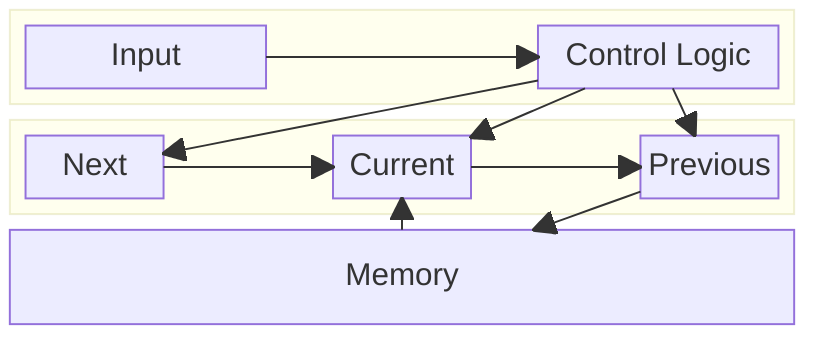

Advent of Code 2025 - FPGA
==========================

I have made solution for the following Days:

- Day 1: Amaranth solutuion
- Day 7: Both Amaranth and Hardcaml

Amaranth solutions are working in hardware in a iCE40 HX8K Evaluation Board.

Overview of files
-----------------

- `day1.py`: Amaranth solution for Day 1
- `day7.py`: Amaranth solution for Day 7
- `utils.py`: Utility library: UART, HexConverter, Streams, Harness, UartWrapper
- `hardcaml/`: Hardcaml solution for Day 7
- `data/`: Example and actual input data for both days.

Day 1
=====
TODO

Challenge description summary
-----------------------------
TODO

Implementation
--------------
TODO

Testing / Validation
--------------------
TODO

Flashing and Programming on an FPGA
-----------------------------------
TODO

Day 7
=====

TODO

Challenge discription summary
-----------------------------
TODO

Implementation
--------------

Both solutions are based on the following block diagram:

Testing / Validation
--------------------
TODO

Flashing and Programming on an FPGA
-----------------------------------
TODO
