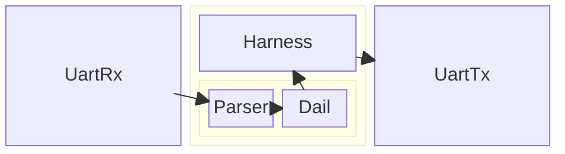
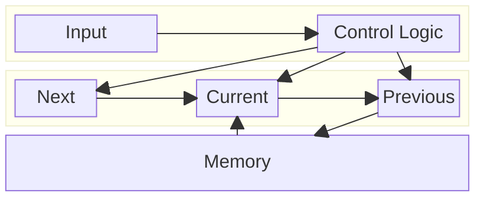

Advent of Code 2025 - FPGA
==========================

I have made solution for the following Days:

- Day 1: Amaranth solutuion
- Day 7: Both Amaranth and Hardcaml

Amaranth solutions are working in hardware in a iCE40 HX8K Evaluation Board.

Overview of files
-----------------

- `day1.py`: Amaranth solution for Day 1
- `day7.py`: Amaranth solution for Day 7
- `utils.py`: Utility library: UART, HexConverter, Streams, Harness, UartWrapper
- `hardcaml/`: Hardcaml solution for Day 7
- `data/`: Example and actual input data for both days.

Day 1
=====
This cahllenge has only been solved in Amaranth

Challenge description summary
-----------------------------
This challenge is about counting 'click' when a dail wrapsaround at 0. The Challenge data is of the format:
```
L1234
R321
R12
...
```
The `L` and `R` iondicates the direction of rotation, while the number of steps is indicated by the number.

Implementation
--------------
The implementation is based on the following block diagram:

Each block is connect by a ready-valid interface, the parser outputs signed numbers.
The Harness takes the output from The dail when the Parser indicates done and hex encodes the part_1 and part_2 outputs for the Uart.

The Harness also controls the reset of the Solution(Parser and Dail)

Testing / Validation
--------------------
The following produces `day1.vcd` for the example data and shows what would have been output to the uart.
```
$ python day1.py test --data data/1_example --vcd day1.vcd --time 1e-2
0000000000000003
0000000000000006
```

Flashing and Programming on an FPGA
-----------------------------------
```bash
$ ./day1.py build --program # Put design on FPGA, FPGA board must be in SRAM programming mode.
```

The design can now be tested in the following way:
```bash
$ tio -b 9600 /dev/ttyUSB1 # Attach to serialport
$ cat data/1_example > /dev/ttyUSB1 # run in different terminal
```

Day 7
=====
This challenge has both been solved in Amaranth and Hardcaml

Challenge discription summary
-----------------------------
TODO

Implementation
--------------

Both solutions are based on the following block diagram:


Testing / Validation
--------------------
TODO

Flashing and Programming on an FPGA
-----------------------------------
TODO
